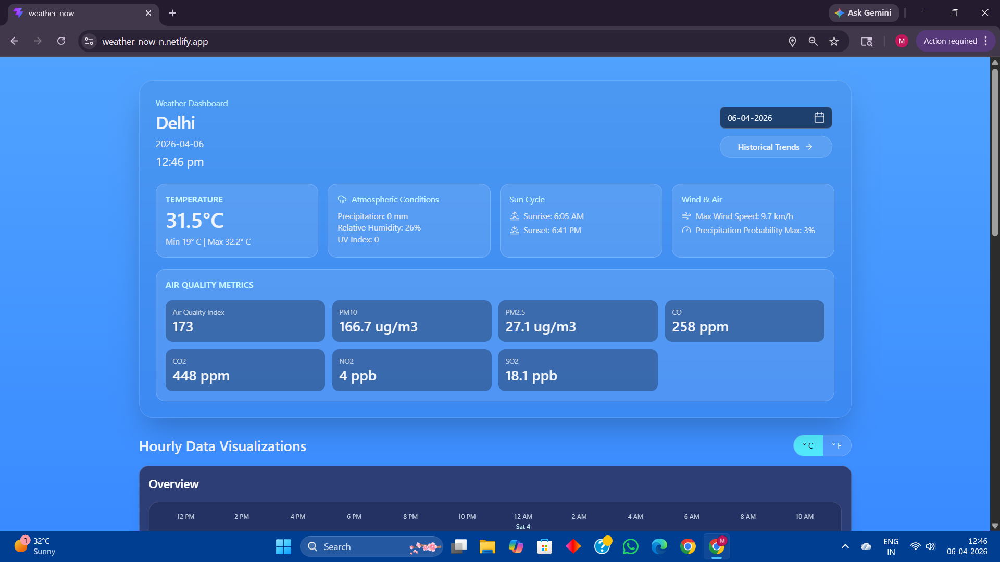
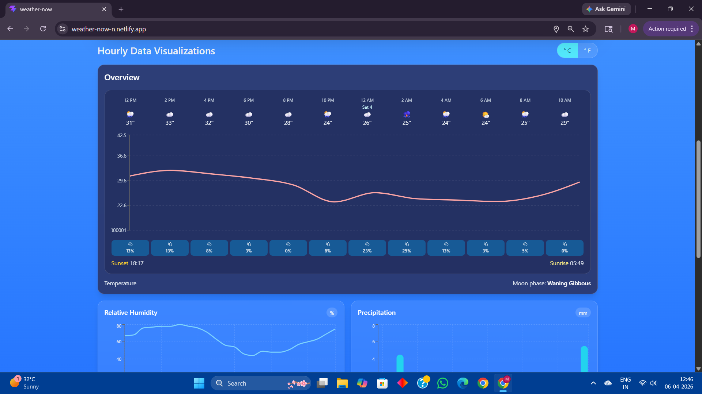
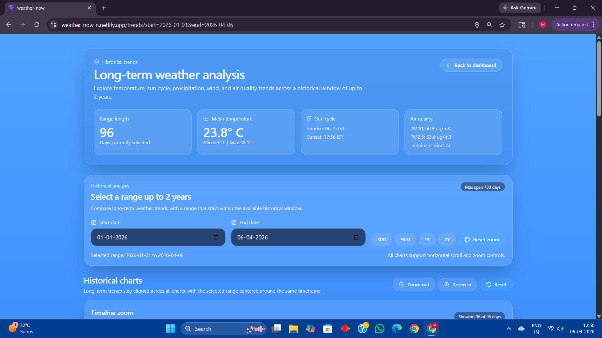
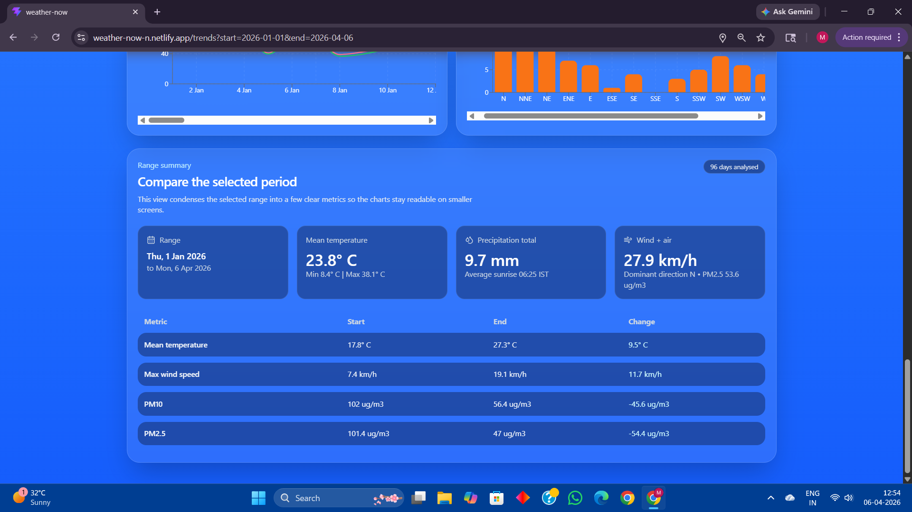
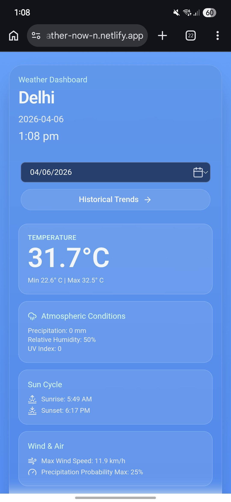
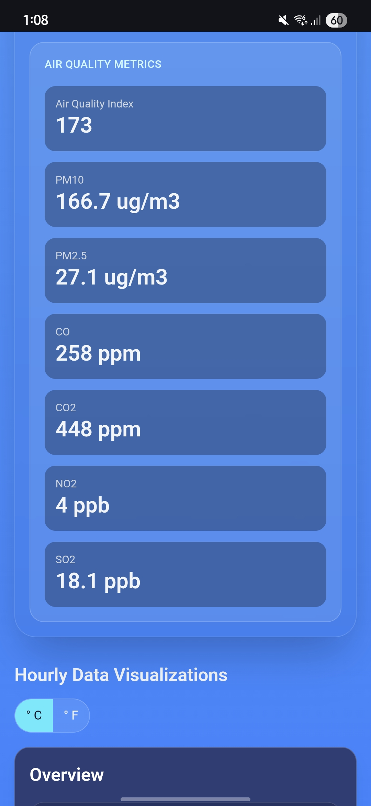
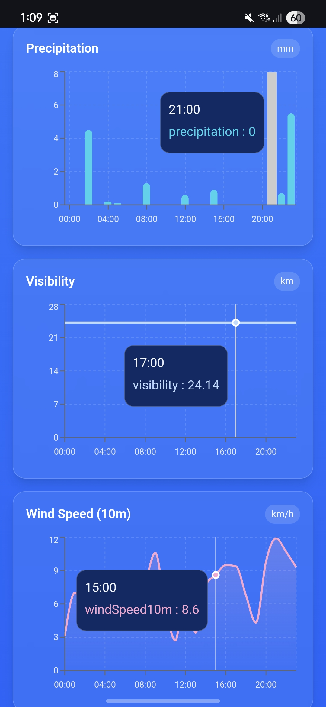
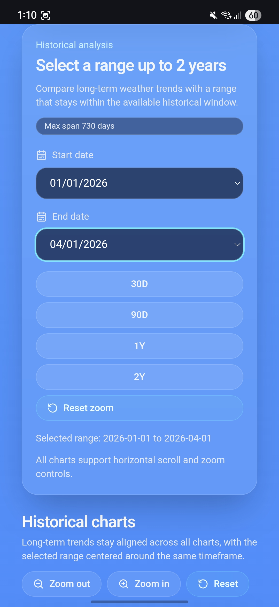

# 🌤️ WeatherNow | Advanced Weather & Historical Analytics

**WeatherNow** is a comprehensive, data-driven weather dashboard that provides real-time atmospheric conditions, hourly forecasts, and long-term historical trends. Built with a focus on high-performance data fetching and interactive visualizations.

🚀 **[Live Demo](https://weather-now-n.netlify.app/)**

---

## 📸 Screenshots

## 📸 Project Showreel

### 🖥️ Desktop Experience
| Main Dashboard | Hourly Analysis |
| :--- | :--- |
|  |  |

| Historical Analytics | Data Comparison |
| :--- | :--- |
|  |  |

### 📱 Mobile-First Design
| Dashboard | Air Quality | Real-time Charts | Historical Range |
| :--- | :--- | :--- | :--- |
|  |  |  |  |

---

## ✨ Key Features

### 1. Interactive Real-Time Dashboard
The main view provides an instantaneous "Snapshot" of your current location.
* **Time-Travel Functionality:** A custom calendar integration that allows users to view weather data for any specific date.
* **Core Parameters:** Displays Current, Min, and Max Temperature, Precipitation, Sunrise/Sunset, Max Wind Speed, Relative Humidity, and UV Index.
* **Comprehensive Air Quality:** Real-time monitoring of PM10, PM2.5, CO, CO2, NO2, and SO2 levels.
* **Hourly Granularity:** Interactive carousels and charts showing parameter shifts at 1-hour intervals.

### 2. Smart Visualizations (Hourly Charts)
We utilize specific chart types optimized for the data nature:
* **Area Charts:** For Temperature and Wind Speed (visualizing "volume" and intensity).
* **Line Charts:** For Humidity, Visibility, and PM10/PM2.5 (tracking continuous trends).
* **Bar Charts:** For Precipitation (discreet hourly totals).

### 3. Historical Trends Analysis (Up to 2 Years)
A dedicated analytics view for long-term climate study:
* **Custom Date Range:** Select any window up to 2 years.
* **Sun Cycle Tracking:** Sunrise and Sunset times converted to **IST (Indian Standard Time)**.
* **Wind Dynamics:** Tracks Max Wind Speed and **Dominant Wind Direction**.
* **Interactive Navigation:** Includes a timeline zoom/brush tool for horizontal scrolling across dense historical datasets.

---

## 🛠️ Technical Stack

### **Frontend & UI**
* **React.js:** Component-based architecture.
* **Tailwind CSS:** Modern glassmorphism UI with responsive design.
* **Recharts:** Powerful SVG-based charting library for complex data visualization.
* **Lucide React:** Clean, consistent iconography.

### **Data Management & API**
* **TanStack Query (React Query):** Implemented for professional server-state management.
    * **Caching:** Data is cached locally to prevent redundant API calls.
    * **Auto-refetching:** Ensures data stays fresh when users switch between pages.
    * **Loading/Error States:** Managed via standardized hooks for a smoother UX.
* **Open-Meteo API:** High-resolution weather and air quality data.
* **Geolocation API:** Automatically detects user city and coordinates.

---

## 🏗️ Project Architecture

To keep the application scalable, I followed a clean "Services" architecture:
1.  **Hooks Layer:** Custom hooks (e.g., `useWeather`) handle all React Query logic.
2.  **Mapper Layer:** A central `weatherMapper.js` transforms raw API JSON into clean, UI-ready objects, decoupling the view from the API structure.
3.  **Component Layer:** Modular components separated into Features (Dashboard, Trends) and Layout (Navbar, Shell).

---

## 🚦 Getting Started

1.  **Clone the repo:**
    ```bash
    git clone https://github.com/muskanmaurya/WeatherNow.git
    ```
2.  **Install dependencies:**
    ```bash
    npm install
    ```
3.  **Start the development server:**
    ```bash
    npm run dev
    ```

---

## 📧 Contact & Support
**Muskan Maurya** - Software Engineering Enthusiast
* **LinkedIn:** [[Muskan Maurya](https://www.linkedin.com/in/muskan-maurya-861473232/)]

---
